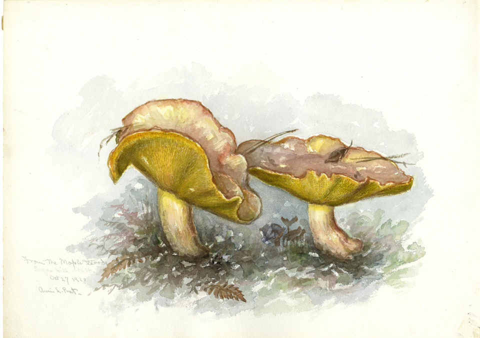
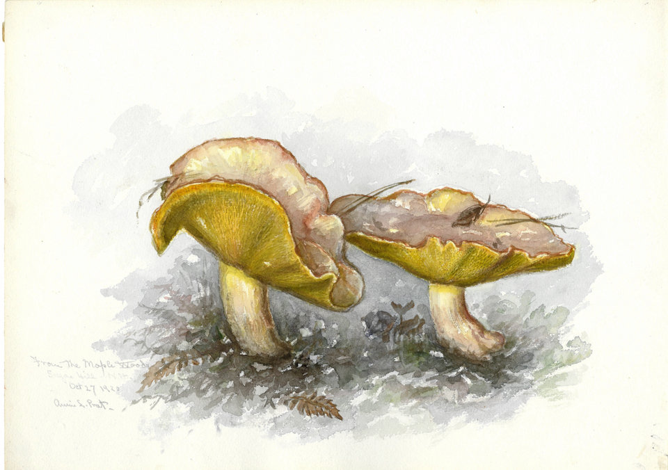
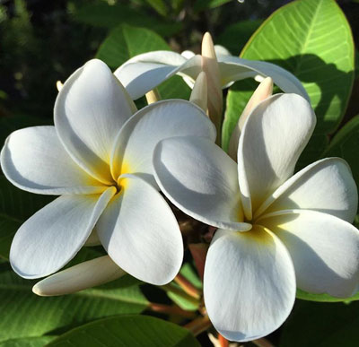
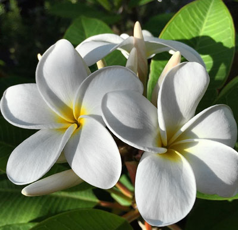
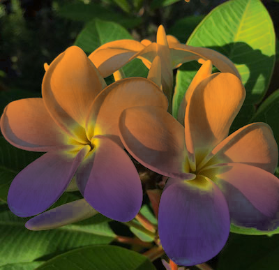
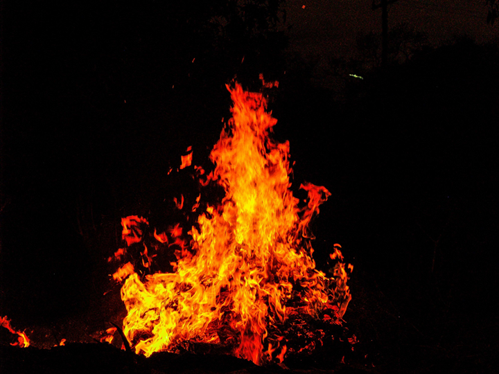
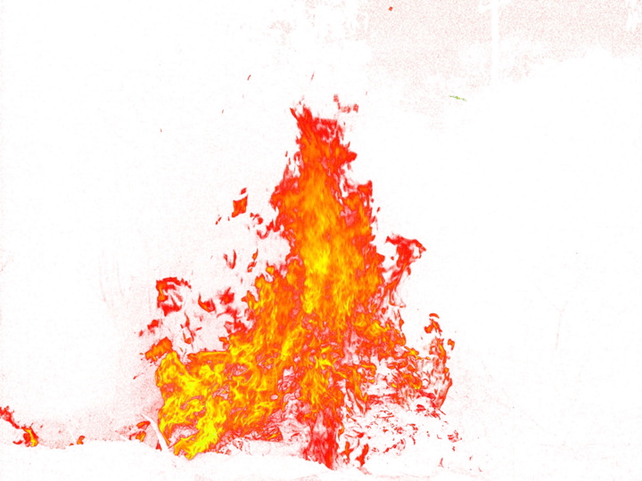
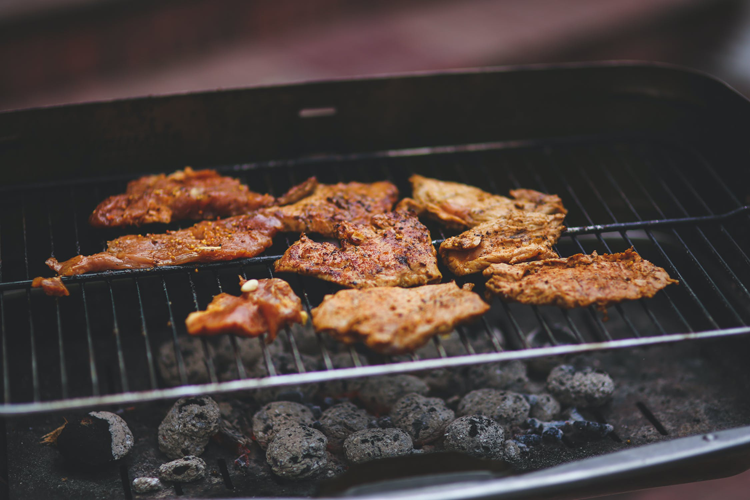
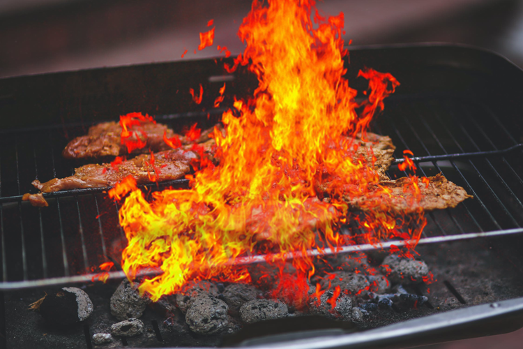

# About
This python aplication and library will remove all white or black from an image, prefectly preserving the color and value of the rest of the image. It's based on a previous photoshop plugin I created, call killwhite.

App Supports 8/16/32 bit RGB images, fastest with 8 bit
Library use numpy and expects 3 channel RGB array

### How it works
In the case of [127] gray pixel, it finds the amount of white in the pixel (50%), then sets the pixel to black, and adds a 50% alpha. Thus the finnal result apear to not have changed but now has a transparency. 99% black is still 1% white and will have a 1% alpha. 

If it affects a reagon your didnt want, use photoshop or another editor and merge the images togeather preserving the areas you want. 

## The recipe:
```
RGB -> HSV
convert to double 
convert to value scale (0-1)

// make the alpha
alpha = 1.0-(v-s)

// preserve color and values
if (alpha < 1.0)
  v = s/alpha
  S = s/alpha

to origional value scale
HSV -> RGB
```

## Use RemoveWhite()
It can be used to remove the background from a logo

 

Add alpha to difficult to edit artwork:

 

combine with other images / color to replace the white in an image:

   

flower source &emsp; &emsp; &emsp; &emsp; &emsp; &emsp; &emsp; &emsp; &emsp; &emsp; &emsp; with alpha from RemoveWhite() &emsp; &emsp; &emsp; &emsp; &emsp;  Add background color



Comnbine in photoshop, notice how it keeps the origional texture and shadows

## Use RemoveBlack()

Stock fire images/video is usualy shot on a black background for ease of adding to other imagery. This makes it even better, no compromise in color or value like with "blendmodes".

 

fire source &emsp; &emsp; &emsp; &emsp; &emsp; &emsp; &emsp; &emsp; &emsp; &emsp; &emsp; &emsp; with alpha from RemoveBlack()

 

grill source &emsp; &emsp; &emsp; &emsp; &emsp; &emsp; &emsp; &emsp; &emsp; &emsp; &emsp; &emsp; aditional mask



finaly combine in photoshop

# Parameters
### -i, --image

this is the path to the desired image

### -a, --alpha_suffix

Optional, Separates the alpha and adds suffix to alpha's filename, without this argument it will write a single file with alpha if the file type supports it. Use this if you want to write a file type without an alpha channel like JPG. 

### -o, --output

output image path and extension

### -b, --remove_black

Optional, With this flag it will remove black, by default it removes white. 

### --plugin

Advanced, Optional, I use the imageio for increased file type compatablity, imageio has multiple methods to write common file types, use this flag to specify which imageio plugin you want to write with. May require additional installation, see imageio docs for more info. Example plugins: [opencv, freeimage, pillow, ITK, GDAL, tifffile]

